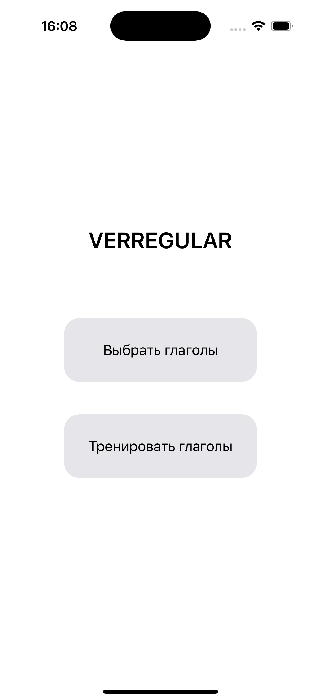
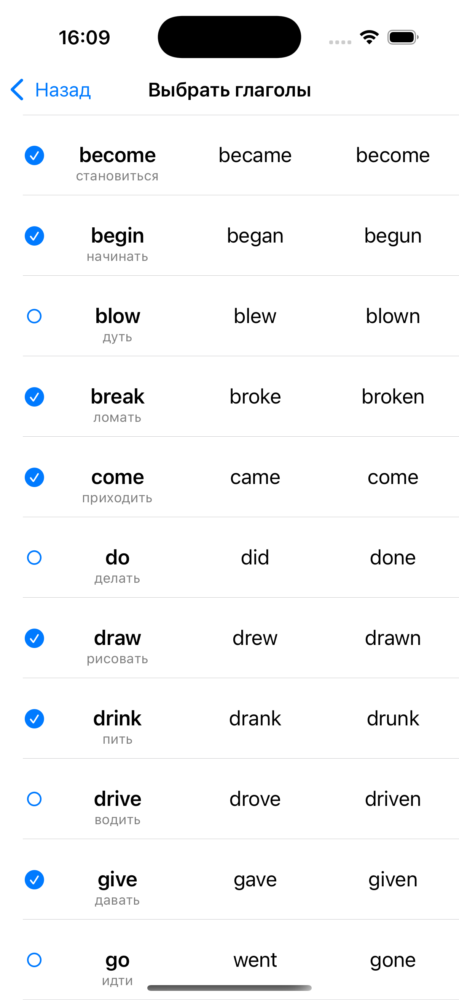
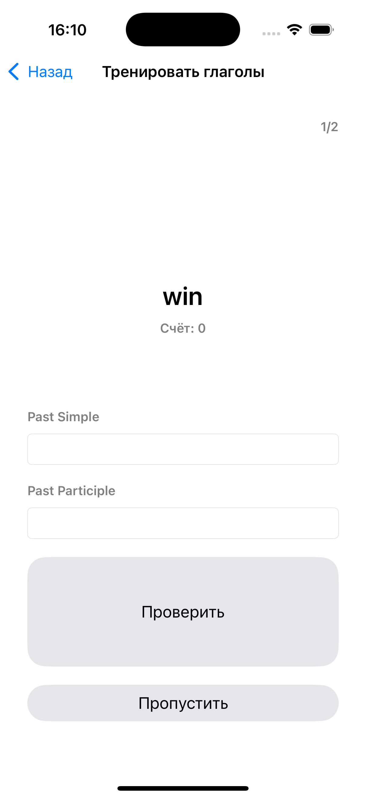
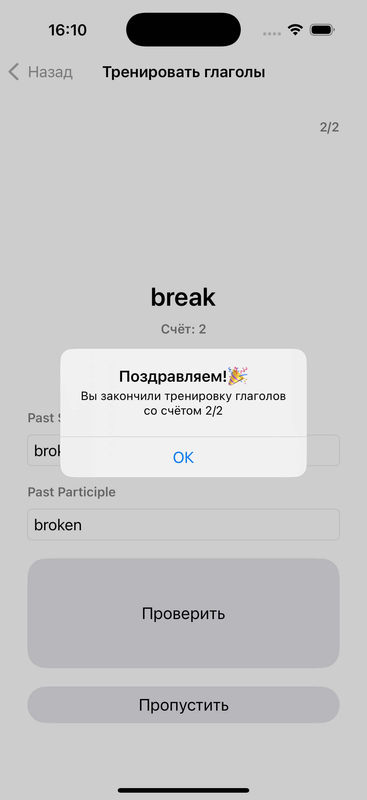

# Irregular Verb App

**Irregular Verb App** is an iOS application designed to help users learn English irregular verbs. The app is built in **Swift** using **UIKit** and follows standard iOS application architecture.

   
---

## Features
- Learn English irregular verbs  
- Navigation-based interface with `UINavigationController`  
- String localization for future multilingual support  
- Ready for future expansion (tests, statistics, additional languages)  
- **MVС Architecture** 
- **Extensions for utilities**: e.g., `String+Ex.swift` for localization and other reusable helpers  
